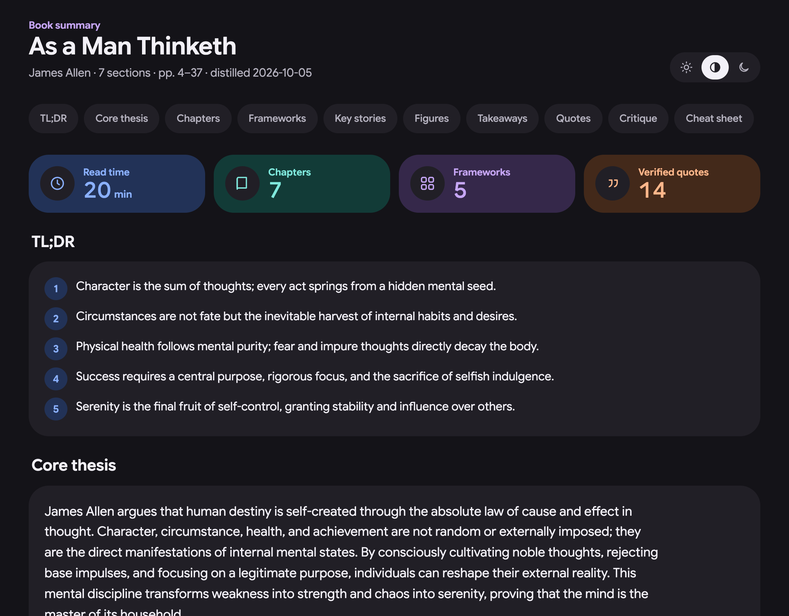

<h1 align="center">📚 Book Distiller Bot</h1>

<p align="center">
  <b>Long books, little time, and summaries online that invent quotes.<br>
  Drop a book in a folder; get a faithful, readable summary back, with every quote checked.</b>
</p>

<p align="center">
  
</p>

<p align="center">
  
  
  
  
</p>

<p align="center">
  
</p>
<p align="center"><sub>A finished summary (<i>As a Man Thinketh</i>, public domain): TL;DR, core thesis, chapters, frameworks, quotes, cheat sheet</sub></p>

## 💡 Why

Most book summaries are either too thin to be useful or quietly make things up. This one reads the whole book,
takes notes chapter by chapter, and keeps a quote only if it really appears in the book, with the page number.

## ⚙️ How it works

<table>
  <tr>
    <td align="center" width="33%"><h3>📥</h3><b>Drop a book in</b><br><sub>Put a PDF or EPUB in your input folder and double-click <code>run-now.command</code></sub></td>
    <td align="center" width="33%"><h3>🧠</h3><b>It reads every chapter</b><br><sub>A local AI model takes notes per chapter, checks every quote against the book, then writes and audits the overview</sub></td>
    <td align="center" width="33%"><h3>📄</h3><b>Get a summary back</b><br><sub>One HTML page in your output folder (20–30 min reads; long books get parts)</sub></td>
  </tr>
</table>

Books whose summary is already in the output folder are skipped, so a run only converts what's new. Stop it any
time; the next run picks up where it left off. You get a Mac notification when a book is done.

## 🚀 Set it up

<table>
  <tr>
    <td align="center" width="33%"><b>1 · Choose folders</b><br><sub>Copy <code>.env.example</code> to <code>.env</code> and set your input and output folders (e.g. in Google Drive)</sub></td>
    <td align="center" width="33%"><b>2 · Check once</b><br><sub><code>./run.sh preflight</code> sets itself up and checks LM Studio and the folders</sub></td>
    <td align="center" width="33%"><b>3 · Use it</b><br><sub>Drop books in the input folder, double-click <code>run-now.command</code></sub></td>
  </tr>
</table>

Needs a Mac with Python 3.9+ and [LM Studio](https://lmstudio.ai) with Qwen3.8 27B.

## 🔒 Private by design

The book and the AI stay on your Mac; nothing is uploaded except through your own Drive sync if your folders are in
Google Drive. Your folder paths live in `.env` and are never committed.

<details>
<summary><b>🛠️ For developers</b></summary>

<br>

<p>
  
  
  
</p>

The model is shared with the other bots through a lease protocol (`distiller/llm.py`, the same as their `kit.js`):
loaded once with one profile, reused, unloaded by the last one out; LM Studio's memory guardrail stays on. If it
can't be had, the run stops with exit code 75 and keeps its progress.

#### Commands

| Command | What it does |
|---|---|
| `./run.sh` (or double-click `run-now.command`) | Summarise every new PDF/EPUB in the input folder. A book whose summary is already in the output folder is skipped. |
| `./run.sh <book>` | One book: a path, a file name in the input folder, or part of a name (`./run.sh thinketh`). |
| `./run.sh <book> --force` | Throw away previous work for that book and redo everything. |
| `./run.sh <book> --from synthesize` | Keep the chapter notes and redo the rest. Steps: `chunk`, `plan`, `extract`, `synthesize`, `images`, `render`. |
| `./run.sh watch` | Keep running and pick up new books as they land in the input folder. |
| `./run.sh preflight` | Check LM Studio, the model, memory and the folders. |

Add `-v` for debug output. Every book logs to `work/<book>/run.log`. Each chapter's notes and each synthesis step
are saved as soon as they finish, so after a crash, Ctrl‑C or `kill` (both stop it within a second, unloading the
model) the same command resumes where it stopped. Only one run at a time: a second one exits with a message.
You get a macOS notification when a book is done.

**Speed** (Qwen3.8‑27B 4-bit MLX on a Mac mini M6, 32 GB): it reads ~106 tokens/s and writes ~8–9 tokens/s per
request. Two requests run at once (`parallel: 2`; 4 is faster but makes a 32 GB Mac swap); every synthesis and
audit call shares one prompt prefix so LM Studio reads the notes once; and the audit returns only corrections.

#### Tuning the style

`style.md` is injected into every writing prompt (chapter notes, synthesis, audit). Edit the reader, tone, depth,
length and formatting there; its "20–30 minute read" line sets the size of one part. Then:

```bash
./run.sh <book> --from synthesize   # new synthesis in the new style (reuses chapter notes)
./run.sh <book> --from extract      # redo the chapter notes too
```

Only `**bold**` and `*italic*` are rendered; the LLM never writes HTML (`templates/summary.html.j2` does the layout).

#### The pipeline (and where to change it)

Every step saves its result in `work/<book>/` before the next one starts, so a run can stop and resume anywhere,
and `--from STEP` redoes one step and everything after it.

| # | Step | What happens | Code | Change it with |
|---|---|---|---|---|
| 1 | **Detect** | Finds `.pdf`/`.epub` files in the input folder, fingerprints each (SHA‑256) and skips books already in `work/index.json`. | `cli.py` → `process()` | `--force` to redo a book |
| 2 | **Read** | Turns the book into one text with a page map, chapter headings and image positions. PDF: PyMuPDF, running headers and page numbers removed. EPUB: ebooklib, in reading order. A scanned PDF stops with an `ocrmypdf` command. | `ingest.py` → `load_pdf()`, `load_epub()` | — |
| 3 | **Chunk** | Splits into chapters: PDF table of contents / EPUB nav first, then "Chapter N" headings, then big-font headings, else fixed ~8K-token pieces. Skips copyright, contents, acknowledgements, notes, index, bibliography and Gutenberg boilerplate; merges tiny chapters and splits huge ones at paragraph breaks. | `chunk.py` → `build_chunks()`; skip lists `SKIP_EXACT`, `SKIP_PREFIX` | `chunk_tokens`, `min_chunk_tokens` |
| 4 | **Plan** | The model reads the contents and opening and decides how many minutes of summary the book deserves (20 min–2 h). That is split into 30-minute **parts** (max 4) and sets each chapter's word budget. Saved in `plan.json`. | `plan.py` → `plan_book()`, `budgets()` | `max_minutes`; the "20–30 minute read" line in `style.md` sets the part size; edit `plan.json` + `--from extract` to force a length |
| 5 | **Extract** | Two chapters at a time, the model writes structured notes: core idea, summary, key arguments, frameworks, data, examples, quotes with pages, takeaways. List sizes scale with the chapter's budget and are enforced by LM Studio. Saved per chapter in `notes/NN.json`. | `extract.py` → `extraction_messages()` (prompt), `note_schema()` (fields and limits) | `style.md`, `parallel` |
| 6 | **Verify** | Every quote is fuzzy-matched against the book. Matches get the book's exact wording and true page; the rest are dropped. Report in `verify.json`. | `extract.py` → `verify_quotes()` | `quote_match_threshold` |
| 7 | **Synthesize** | Whole-book overview in three calls: (a) TL;DR, core thesis, themes; then in parallel (b) frameworks, key stories and (c) takeaways, critique, cheat sheet. Notes too big for the context are condensed in groups first. | `synth.py` → `PARTS` (prompts and schemas), `Synthesizer.run()` | `style.md`; `SYNTH_MAX` in `plan.py` |
| 8 | **Audit** | One call checks the overview against the notes and returns only fixes (replace / remove / add) for unsupported claims, contradictions, gaps or wrong chapter refs. Fixes are validated, applied, and listed at the bottom of Part 1. | `synth.py` → audit prompt in `run()`, `apply_fixes()` | — |
| 9 | **Figures** | Pulls images and vector charts, drops small, odd-shaped, repeated and duplicate ones; the model keeps only diagrams, charts and tables and captions them. | `images.py` → `candidates()`, `process_images()` | `image_cap`, `image_candidates`, `min_image_px` |
| 10 | **Render** | Splits chapters into the planned parts (book order, similar length; Part 1 also holds the overview) and writes one HTML file per part in the RTI-dashboard style, with links between parts. The model never writes HTML. | `pipeline.py` → `render()`; `plan.py` → `split_parts()`; `templates/summary.html.j2` | the template |
| 11 | **Save** | Writes `<Title> – Summary.html` (or `… (Part 1 of 3).html` …) into the output folder, moves superseded files from an earlier run to the Trash, sends a notification. | `cli.py` → `process()` | `output_dir`, `notify` |

**Model calls** go through `llm.py`: it takes Qwen3.8 through the lease protocol (shared with the other bots),
streams every response, and retries with a pause. Text calls use Qwen's own prompt format with
thinking switched off; figure checks use the chat endpoint because they send images.

#### Files

```
distiller/        the run, one module per step: ingest → chunk → plan → extract → synth → images → render;
                  pipeline (steps, resume), cli (commands, folders), llm (model sharing, requests), util
templates/        summary.html.j2 (the page layout)
tests/            test_offline.py (chunking, quotes, rendering) · test_lease.py (model sharing, config)
style.md          the voice of your summaries      config.json   settings (validated on load)   .env / .env.example  your input and output folders
run.sh            ./run.sh [book] [--force] [--from STEP] | watch | preflight (creates .venv on first run)
run-now.command   double-click = ./run.sh           pii-check.sh  personal-data gate before a commit
requirements.txt  Python packages
input/ · output/  default folders when input_dir/output_dir are relative (gitignored)
work/<book>/      (gitignored) doc.json, chunks.json, plan.json, notes/, synthesis/, images/, verify.json, run.log
```


#### When something goes wrong

A failed book shows a macOS notification. Details: `work/<book>/run.log` (every step, with the error). `.venv/bin/python -m unittest discover tests` checks the code without the model.


- **Not enough free memory for qwen3.8-27b-mlx**: quit other apps (Chrome is usually the biggest) and run again.
  Don't relax the guardrail.
- **"Waiting for … to finish"**: another app's model is busy; the run continues by itself once it is idle or
  unloaded, or stops after 10 min (exit 75) with its progress saved.
- **No usable text layer**: the PDF is scanned. `brew install ocrmypdf`, then `ocrmypdf --skip-text in.pdf out.pdf`.
- **Odd chapter splits**: check the chunk list at the top of `work/<book>/run.log`, tune `chunk_tokens` /
  `min_chunk_tokens`, then `--from chunk`.

**License:** MIT.

</details>
